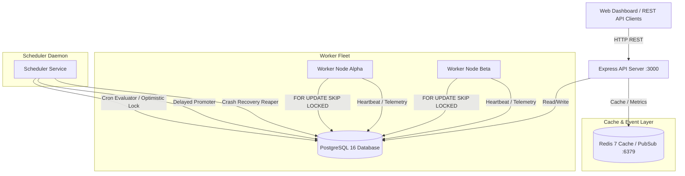

# System Architecture — Distributed Job Scheduler

## 1. High-Level Architecture Overview

The Distributed Job Scheduler is a production-grade, fault-tolerant platform built to reliably ingest, schedule, and execute background jobs across multiple worker processes.

---

## 2. Component Specifications

### A. Express API Layer (`apps/api`)
- **JWT Authentication & Tenant Security**: Parses Bearer tokens and enforces multi-tenant organization boundaries.
- **Zod Request Validation**: Validates all incoming payloads before database mutation.
- **Job Ingestion Engine**: Handles single jobs, delayed jobs (`availableAt`), batch requests, and `idempotencyKey` deduplication.

### B. Database Layer (`packages/database` — PostgreSQL 16)
- **Atomic Job Claiming**: Uses native `SELECT ... FOR UPDATE SKIP LOCKED` for zero-contention row locking.
- **Comprehensive Indexing**: B-Tree indexes on `(queueId, status, priority, availableAt)`, `(status, availableAt)`, and `(lockedUntil, status)`.

### C. Worker Fleet Execution Engine (`apps/worker`)
- **Concurrent Polling Loop**: Polls active queues based on worker concurrency capacity.
- **Pluggable Handler Registry**: Dispatches jobs to specialized handlers (`email_notification`, `report_generation`, `webhook_delivery`, `failure_demo`).
- **Exponential Retry & DLQ Routing**: Calculates backoff delay with jitter on failure; routes exhausted jobs (`attempts >= maxAttempts`) to Dead Letter Queue (`DEAD`).
- **Heartbeat Manager**: Emits CPU, memory, and active job load telemetry every 5 seconds.

### D. Scheduler Service (`apps/scheduler`)
- **Recurring Cron Evaluator**: Evaluates 5-field cron schedules with **Multi-Replica Optimistic Locking** (`lockToken` + `lockExpiresAt`).
- **Delayed Job Promoter**: Promotes `SCHEDULED` jobs to `QUEUED` when `availableAt <= NOW()`.
- **Crash Recovery Reaper**: Reaps silent workers (>30s stale) and recovers orphaned job leases (`lockedUntil < NOW()`) from crashed worker processes (`kill -9`).

---

## 3. Core Data Flow & State Machine

```mermaid
stateDiagram-v2
    [*] --> QUEUED: Immediate Job Created
    [*] --> SCHEDULED: Delayed Job Created (availableAt > NOW)
    SCHEDULED --> QUEUED: Promoter (availableAt <= NOW)

    QUEUED --> RUNNING: Worker Claims (FOR UPDATE SKIP LOCKED)
    RUNNING --> COMPLETED: Handler Success
    RUNNING --> RETRYING: Handler Error (attempts < maxAttempts)
    RETRYING --> QUEUED: Backoff Delay Elapsed

    RUNNING --> DEAD: Handler Error (attempts >= maxAttempts)
    DEAD --> DLQ: Routed to Dead Letter Queue
    DLQ --> QUEUED: Admin Manual Replay

    RUNNING --> QUEUED: Reaper Recovery (Worker Process Crashed)
    QUEUED --> CANCELLED: User Cancellation
```

