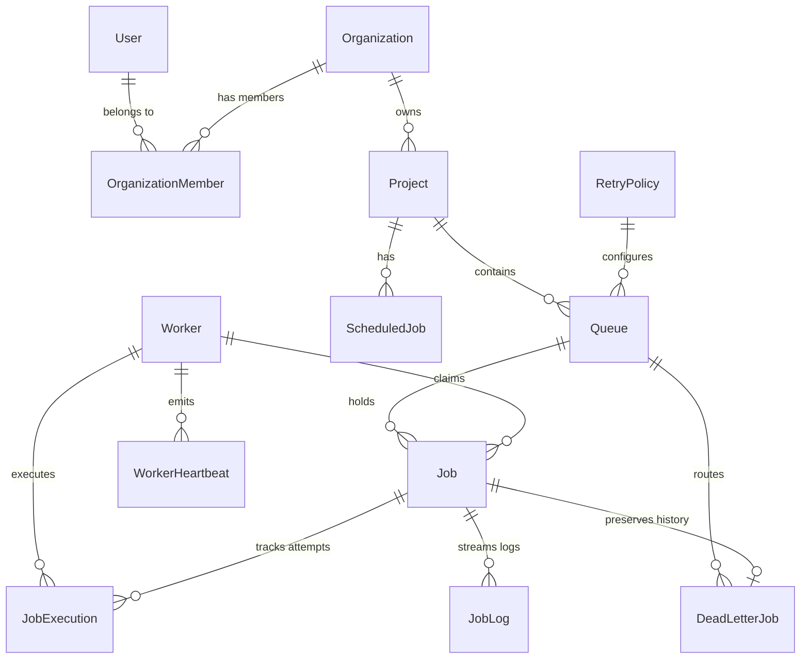

# Database Design & Schema Specification — PostgreSQL 16

## 1. Entity-Relationship (ER) Diagram

---

## 2. Table Specifications & Indexing Rationale

### A. `jobs` Table
- **Primary Key**: `id` (UUID v4)
- **Foreign Keys**: `queueId -> queues(id)` (`onDelete: Restrict`), `lastWorkerId -> workers(id)` (`onDelete: SetNull`)
- **Key Columns**:
  - `availableAt`: Earliest timestamp eligible for worker claim query (`WHERE availableAt <= NOW()`).
  - `lockedUntil`: Lease expiration timestamp for crash recovery detection.
  - `idempotencyKey`: Unique constraint `@@unique([queueId, idempotencyKey])` for deduplication.
- **Indexes**:
  - `@@index([queueId, status, priority, availableAt])`: Primary B-Tree index optimizing Worker `SKIP LOCKED` claim queries.
  - `@@index([status, availableAt])`: Optimizes Delayed Promoter query (`SCHEDULED` -> `QUEUED`).
  - `@@index([lockedUntil, status])`: Optimizes Crash Recovery Reaper query.

### B. `job_executions` Table
- **Primary Key**: `id` (UUID v4)
- **Unique Constraint**: `@@unique([jobId, attemptNumber])` — guarantees zero duplicate execution rows per attempt.
- **Status Enum**: Separate `ExecutionStatus` (`RUNNING`, `COMPLETED`, `FAILED`, `TIMED_OUT`).

### C. `dead_letter_jobs` Table
- **Primary Key**: `id` (UUID v4)
- **Foreign Keys**: `originalJobId -> jobs(id)` (`@unique`, `onDelete: Restrict`), `queueId -> queues(id)` (`onDelete: Restrict`).
- **Design Rationale**: Retains FK back to the original `Job` row without deleting historical logs or execution records.

### D. `scheduled_jobs` Table
- **Columns**: `cronExpression`, `nextRunAt`, `lastRunAt`, `lockToken`, `lockExpiresAt`.
- **Locking Rationale**: Optimistic locking fields prevent race conditions across parallel scheduler replicas.
